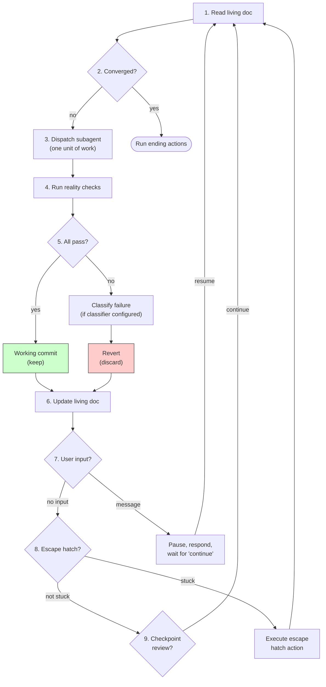

# Autonomous Loop

## Overview

Orchestrate an autonomous loop: dispatch a subagent to do one unit of work per iteration, reality-check the result, keep or discard, repeat until the goal is met.

**Core principle:** Every iteration must make contact with reality. No iteration is kept without passing all reality checks.

**This skill is not invoked directly.** Domain skills (e.g. `/auto:research`, `/auto:refactor`) handle setup and write a living document with a Loop Configuration section. This skill reads that configuration and runs the loop.

## Reading the Configuration

On entry, read the living document specified by the domain skill. Find the **Loop Configuration** section and extract:

| Parameter | Type | Purpose |
|-----------|------|---------|
| **goal** | string | What "done" looks like |
| **living_doc** | path | Path to this living document |
| **iteration_prompt** | string | Template for what the subagent does each iteration |
| **reality_checks** | list of shell commands | All must pass to keep |
| **discard_action** | shell command | How to revert. Default: `git checkout HEAD -- . && git clean -fd` |
| **ending_actions** | list of action names | Ordered list to run when the loop ends |
| **escape_hatch** | structured | When and how to break out (see below) |
| **convergence_check** | string | How to determine if the goal is met |
| **failure_classifier** | string or null | How to classify failures. Null = all failures are simple discards |
| **update_living_doc** | string | How to update the living doc after each iteration |
| **checkpoint_review** | string or null | Reviewer prompt for periodic checkpoints. Null = no reviewer |
| **checkpoint_interval** | number or condition | How often to trigger review |

The Loop Configuration is written in a readable key-value format. Do not parse it programmatically — read it naturally as text.

### Escape Hatch Structure

The escape hatch has these fields:
- **consecutive_discard_threshold** — how many consecutive discards before triggering (e.g. 3)
- **action** — what to do: `generate_new_ideas`, `skip_and_count`, or `stop`
- **skip_threshold** — for `skip_and_count`: how many skips before stopping (e.g. 3)
- **escalation_prompt** — what the subagent should do when triggered

## Branch and Commit Strategy

Before the first iteration (skip if resuming on an existing working branch):
1. Create a working branch: `auto/<domain>-<YYYYMMDD-HHMMSS>` (e.g. `auto/refactor-20260320-143022`)
2. Switch to it

Working commits use the message format:
```
auto(<domain>): <one-line description of what changed>
```

Example: `auto(refactor): replace unwrap() with ? in src/bindings/types.rs`

The `tidy-branch` ending action identifies loop commits by this `auto(<domain>):` prefix.

## The Loop



### Step by step:

1. **Read the living doc.** This is your source of truth — candidates, ideas, strategy, what's been done.

2. **Assess convergence.** Evaluate the `convergence_check` against the current state of the living doc. If converged → run ending actions and stop.

3. **Dispatch a subagent.** Construct the subagent prompt by combining:
   - The **goal**
   - The **iteration_prompt** template
   - **Relevant context from the living doc** — candidates, ideas, strategy, scope, learnings
   - **Relevant file contents** if referenced in the living doc

   Each subagent gets clean context. No accumulated history from previous iterations. The subagent does ONE unit of work and returns.

4. **Run reality checks.** Execute each command in the `reality_checks` list. All must pass.

5. **Gate:**
   - **All pass →** create a working commit with message `auto(<domain>): <description>`. This is a keep.
   - **Any fail →** if `failure_classifier` is configured, evaluate it against the failure output to classify the failure (and record the classification in the living doc). Then revert via the `discard_action`.

6. **Update the living doc.** Follow the `update_living_doc` prompt to record what happened this iteration. The domain skill controls what gets written and where — follow its instructions.

7. **Check for user input.** If the user has sent a message, finish the current iteration, then pause and respond.

   Recognized commands:
   - **`done`** — end the loop, run ending actions
   - **`pause`** — pause after current iteration
   - **`skip <path>`** — exclude a path from future iterations (update living doc)
   - **Any other message** — pause, respond. User says "continue" to resume.

8. **Check escape hatch.** Track consecutive discards. The counter persists across pause/resume — user interaction does not reset it. A kept iteration resets the counter to zero.

   If the counter reaches `consecutive_discard_threshold`:
   - **`generate_new_ideas`** — dispatch a subagent with the `escalation_prompt` to brainstorm new approaches. Reset counter.
   - **`skip_and_count`** — skip the current area, increment skip counter. If skip counter reaches `skip_threshold`, stop the loop and run ending actions.
   - **`stop`** — stop the loop immediately and run ending actions.

9. **Checkpoint review.** If `checkpoint_review` is configured and the interval has been reached (N iterations since last review, or a domain-specific condition like "pattern complete"):
   - Run the full reality checks (not just the fast subset)
   - Dispatch a reviewer subagent on the accumulated diff since last review
   - If the reviewer flags issues, fix them before continuing
   - The reviewer may request reverting specific working commits if changes are net-negative
   - Reset the checkpoint counter

10. **Go to step 1.**

## Context Management

Each iteration dispatches a subagent, keeping the orchestrator's context lean. The orchestrator only holds the living doc contents and the latest iteration result. This allows the loop to run for hundreds of iterations without hitting context limits.

If context pressure builds (compaction happening, responses getting shorter), write a resume point to the living doc and stop cleanly. The user re-invokes the domain skill, which detects the existing living doc and offers to resume.

## Ending Actions

When the loop ends (convergence, user says `done`, or escape hatch stop), run the declared ending actions in order.

### `report`

Summarize what happened:
- Goal and outcome (metrics, diff stats, or whatever is relevant)
- Iterations: kept / discarded / total
- What worked, what didn't
- Actionable recommendations: test-blocked improvements, skipped items needing design decisions, remaining ideas
- Suggested follow-up tasks: if the loop discovered work that would benefit from a different loop, surface these as concrete invocations (e.g. "Run `/auto:refactor simplify data loading` to unlock further metric improvement")

### `tidy-branch`

Clean up the git history. The user has already confirmed "done."

1. Create backup branch: `auto/backup-<timestamp>` pointing at current HEAD
2. Squash all `auto(<domain>):` commits into one commit
3. Split into thematically grouped commits — propose the grouping to the user
4. Each grouped commit must pass all reality_checks independently
5. User reviews and approves the proposed grouping before execution
6. Execute: `git reset --soft <baseline-commit>`, re-commit in approved groups

Non-loop commits on the branch (if any) are left untouched.

### `remove-notes`

Delete the living document and any other working files created during the loop (e.g. `autoresearch.sh` is NOT a working file — it's user code). These don't belong in a PR.

### `tidy-notes`

Squash the living document changes into a single commit on top of the branch. A `git reset HEAD~1` cleanly removes all working notes without touching the real work underneath. Available for domain skills that want notes separable but present during review.

## Branch Ownership

The working branch is exclusively owned by the loop during execution.

- No manual commits should be made while the loop is running.
- If the loop detects unexpected commits (commits without the `auto(<domain>):` prefix that weren't present at the start of the iteration), pause and ask the user.
- The `tidy-branch` ending action only squashes commits matching the `auto(<domain>):` prefix.

## Red Flags — STOP

- Running an iteration without reading the living doc first
- Keeping a change that failed any reality check
- Skipping the reality check because "it's obviously fine"
- Letting the orchestrator accumulate context instead of dispatching subagents
- Continuing to grind after hitting the escape hatch threshold without executing the escape action
- Making multiple changes in a single iteration instead of one focused change

## Integration

- **REQUIRED SUB-SKILL of:** `auto:research`, `auto:refactor`, and any future domain skill
- **Not invoked directly by users**
