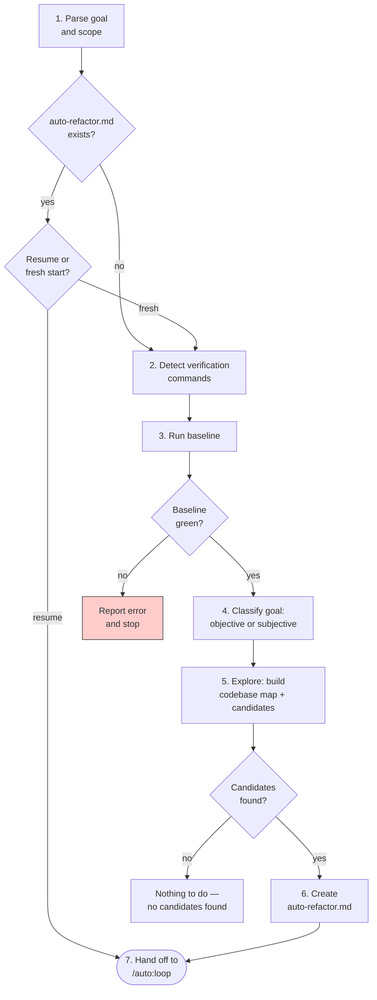

# Autonomous Refactoring

## Overview

An autonomous refactoring loop: scan the code for candidates, transform one at a time, verify each change, keep or revert, repeat until the goal is met.

**Core principle:** Refactoring is strategic, not mechanical. Each transformation reveals the next. The orchestrator is a strategist, not a queue processor.

**Violating the letter of the process is violating the spirit of the process.**

## When to Use

- Applying a pattern across a codebase ("replace all unwrap() with proper error handling")
- Making code idiomatic ("idiomatic Rust in src/bindings/")
- Simplifying or restructuring ("simplify error types")
- Any goal where the code tells you what to do next

**Not for:**
- Optimizing a measurable metric → use `/auto:research`
- One-off changes to a single file → just do it
- Design migrations driven by a spec → use spec-driven development

## Invocation

```
/auto:refactor <goal> [in <scope>]
```

Examples:
- `/auto:refactor idiomatic Rust in src/bindings/`
- `/auto:refactor replace all unwrap() with proper error handling in src/`
- `/auto:refactor simplify error types`

**Parameters:**
- **Goal** — what the code should become. Can be a specific pattern ("replace X with Y") or open-ended ("idiomatic Rust", "simplify").
- **Scope** — directory, file list, or glob. Defaults to current directory if omitted.

## Setup Phase



### Step by step:

1. **Parse goal and scope** from invocation.

2. **Check for existing `auto-refactor.md`** in the current directory. If found, ask the user: "Found a previous auto-refactor session. Resume or start fresh?" If resume, skip to step 7.

3. **Detect verification commands** — look for project markers in the project root:
   - `Cargo.toml` → `cargo test`
   - `package.json` → `npm test`
   - `pyproject.toml` → `pytest`
   - `go.mod` → `go test ./...`
   - `Makefile` → `make test`

   If multiple markers found or ambiguous, present all detected commands and ask the user to confirm. Also ask: "Want a faster subset for iterations and full suite for checkpoints?" (e.g. `cargo test --lib` vs `cargo test`).

4. **Run baseline verification** — all confirmed commands must pass. If red, stop and report. Do not proceed with a broken baseline. **Record the current HEAD commit hash** as baseline.

5. **Classify goal:**
   - **Objective** — specific pattern → specific target (e.g. "replace unwrap() with ?"). Tests alone are a sufficient judge. Checkpoint reviewer will be skipped.
   - **Subjective** — requires taste (e.g. "idiomatic Rust", "simplify", "clean up"). Checkpoint reviewer will be invoked.

   If uncertain, default to subjective.

6. **Dispatch exploration subagent** to survey the scoped code. It builds:
   - A **codebase map** — each file in scope with a brief note on its purpose and relevant patterns found
   - A **candidate list** — specific refactorings, prioritized, with file paths, line references, and enough context that a worker subagent can act without re-exploring

   If no candidates found, exit cleanly: "Nothing to do — no instances of this pattern found in scope."

7. **Create `auto-refactor.md`** with the template below, including the Loop Configuration section.

8. **Hand off to `/auto:loop`.** Say: "Setup is complete. Now follow the `/auto:loop` skill to run the loop."

## Living Document (`auto-refactor.md`)

```markdown
# Auto-refactor: <goal>

## Loop Configuration
- goal: <what the code should become>
- living_doc: auto-refactor.md
- iteration_prompt: Read the Strategy and Candidates sections. The orchestrator has chosen the next candidate for you — transform it. Make one focused change. Do not change anything outside the candidate's scope.
- reality_checks: ["<fast subset command>"]  # e.g. "cargo test --lib"
- discard_action: git checkout HEAD -- . && git clean -fd
- ending_actions: ["report", "tidy-branch", "remove-notes"]
- escape_hatch: { consecutive_discard_threshold: 3, action: skip_and_count, skip_threshold: 3, escalation_prompt: "Skip this area of the codebase and move to a different candidate region." }
- convergence_check: No candidates remain and the most recent transformation did not reveal new opportunities after re-scanning
- failure_classifier: Classify as GENUINE FAILURE if the change broke real behavior (observable output, API contract, runtime error). Classify as TEST-BLOCKED IMPROVEMENT if the change is sound but tests assert on internal structure rather than behavior. For test-blocked improvements, record: what was attempted, which tests blocked it, what needs to change about the tests, what the change would unlock.
- update_living_doc: Move completed candidate to What's Been Done with commit hash. Update Codebase Map if the file's description changed. Re-assess Candidates — add new ones revealed by this transformation, remove invalidated ones. Update Strategy if the direction has shifted. For discards, record in What's Been Skipped (genuine failure) or Test-Blocked Improvements (test-blocked).
- checkpoint_review: "Are these changes actually improvements? Is the style consistent across changes? Any drift from the goal or missed opportunities?"  # for subjective goals; null for objective
- checkpoint_interval: 5  # or "when pattern complete" for pattern-targeted goals

## Goal
<what the code should become>
Type: <objective | subjective>
Baseline commit: <hash>

## Scope
<files/directories>
Excluded: <none initially — updated via /skip>

## Verification
- Full: <full verification command>
- Fast subset: <fast subset if configured, otherwise same as full>

## Strategy
<overall direction — where the code is heading and why.
This is the orchestrator's strategic assessment. Updated after each iteration
as transformations reveal new structure. A new orchestrator should be able
to read this section and understand the current direction.>

## Codebase Map
- <file path> — <purpose, relevant patterns found>
- ...

## Candidates
1. <what to transform — file:line, priority, context snippet>
2. <what to transform — file:line, priority, context snippet>
- ...

## What's Been Done
<empty — populated as the loop runs>

## What's Been Skipped
<empty — genuine failures that were reverted>

## Test-Blocked Improvements
<empty — sound refactorings blocked by tests asserting on old structure>

## Review Notes
<empty — populated at checkpoint reviews>
```

## The Orchestrator as Strategist

The orchestrator is NOT a queue processor. It reassesses after every iteration.

Refactoring transformations compound and cascade: a move enables a rename, which reveals an extract-function opportunity, which enables another move. The orchestrator maintains a **direction** — an understanding of where the code is heading — and chooses the next transformation based on what previous changes revealed.

After each iteration:
- **Add** new candidates revealed by the change
- **Remove** candidates invalidated by the change
- **Reprioritize** based on what the latest transformation unlocked
- **Update the Strategy** if the direction has shifted

The candidate list is living. A "no more candidates" finding is only final if the most recent transformation didn't reveal new opportunities — which requires re-scanning.

## Failure Classification

When reality_checks fail, the `failure_classifier` distinguishes two cases:

### Genuine Failure

The refactoring broke real behavior — observable output changed, API contract violated, runtime error introduced. **Revert and move on.** Record in What's Been Skipped.

### Test-Blocked Improvement

The refactoring is sound but tests assert on the old structure (testing implementation rather than behavior). **Revert, but record as an actionable recommendation:**

- **Transformation:** what was attempted
- **Blocked by:** which specific tests
- **What needs to change:** concrete action to update the tests
- **Unlocks:** what becomes possible after the tests are updated

These are surfaced in the `report` ending action as actionable next steps. The user can update those tests and re-run the refactoring.

## Convergence

The loop ends when the orchestrator determines no further transformations move the code meaningfully toward the goal:

- **Objective goals:** no more candidates exist
- **Subjective goals:** additionally, the checkpoint reviewer rejects remaining proposals as not being improvements

Convergence requires re-scanning after the last change — a "no more candidates" finding is only final if the most recent transformation didn't reveal new opportunities.

## Ending Actions

This skill uses `ending_actions: ["report", "tidy-branch", "remove-notes"]`:

1. **Report** — summarize what changed, what's skipped, test-blocked improvements, and suggested follow-up tasks
2. **Tidy branch** — squash working commits into thematic groups, each passing reality checks
3. **Remove notes** — delete `auto-refactor.md` (it doesn't belong in a PR)

## Common Rationalizations

| Excuse | Reality |
|--------|---------|
| "This candidate is too complex, let me do multiple changes at once" | Complex candidates get broken into sub-candidates. One change per iteration. |
| "Tests failed but the refactoring is obviously correct" | Classify the failure. If test-blocked, record it. If genuine, revert. Don't override reality checks. |
| "No need for a reviewer, I can see the changes are good" | If the goal is subjective, the reviewer catches drift you can't see from inside the loop. |
| "Let me also fix this unrelated thing while I'm here" | Stay on goal. Unrelated improvements go in a separate invocation. |
| "The candidate list is empty so we're done" | Re-scan first. The last transformation may have revealed new opportunities. |
| "I'll skip the codebase map update, it's overhead" | A stale codebase map leads the next subagent astray. Keep it current. |

## Red Flags — STOP

- Changing multiple candidates in one iteration
- Keeping a change that failed tests without classifying the failure
- Continuing past the escape hatch without executing the escape action
- Not re-scanning for new candidates after the last change
- Ignoring the strategy and just popping from the candidate list

## Integration

- **REQUIRED SUB-SKILL:** `auto:loop`
- **Uses:** Bash tool for running verification commands
- **Pairs with:** `/auto:research` when the report suggests performance should be re-verified after structural changes
- **Uses patterns from:** `superpowers:test-driven-development` (verify before and after), `superpowers:requesting-code-review` (checkpoint reviewer dispatch)
