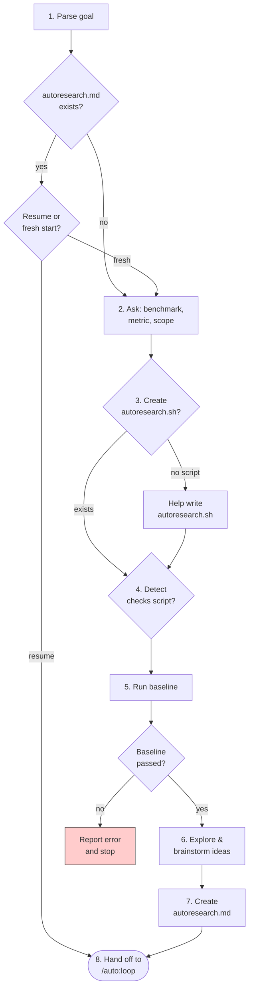

# Autonomous Research

## Overview

An autonomous optimization loop: try an idea, measure it, keep what works, discard what doesn't, repeat.

**Core principle:** Every change is measured. No change is kept without evidence of improvement.

**Inspired by:** pi-autoresearch, karpathy/autoresearch.

## When to Use

- Optimizing any measurable metric (performance, size, latency, throughput, memory, scores)
- Exploring which of many possible changes actually helps
- Running experiments you'd otherwise do manually one at a time

**Not for:**
- Refactoring toward a design goal → use `/auto:refactor`
- One-off benchmarks → just run them
- Changes where there's no measurable metric

## Invocation

```
/auto:research <goal>
```

Examples:
- `/auto:research reduce bundle size`
- `/auto:research improve cold start latency`
- `/auto:research optimize SQL query performance for the dashboard endpoint`

## Setup Phase



### Step by step:

1. **Parse goal** from invocation.

2. **Check for existing `autoresearch.md`** in the current directory. If found, ask the user: "Found a previous autoresearch session. Resume or start fresh?" If resume, skip to step 8.

3. **Ask the user for:**
   - **Benchmark command** — or detect `autoresearch.sh` if it exists. The script should output `METRIC name=value` lines (e.g. `METRIC bundle_size=342`). For noisy benchmarks, recommend running the workload multiple times and reporting the median.
   - **Metric to optimize** — name, units, direction (lower/higher is better)
   - **Scope** — what files are fair game to change

4. **If no benchmark script exists,** help the user write `autoresearch.sh` that runs the workload and outputs `METRIC name=value` lines.

5. **Optional:** detect `autoresearch.checks.sh` or ask if there's a correctness check (tests, type checking, lint) that should gate changes. Not every research loop needs this — only when the optimization might break correctness.

6. **Run baseline benchmark.** Record the baseline metric value. If the benchmark fails, stop and report the error. Do not proceed with a broken baseline.

7. **Dispatch an exploration subagent** to read the scoped code and brainstorm initial ideas. The subagent should return a prioritized list of optimization ideas with rationale.

8. **Create `autoresearch.md`** with the template below, including the Loop Configuration section.

9. **Hand off to `/auto:loop`.** Say: "Setup is complete. Now follow the `/auto:loop` skill to run the loop."

## Living Document (`autoresearch.md`)

```markdown
# Autoresearch: <goal>

## Loop Configuration
- goal: <what we're optimizing>
- living_doc: autoresearch.md
- iteration_prompt: Pick one idea from the Ideas section. Make the code change in scope. The change should be focused — one idea per iteration. Report what you tried and why.
- reality_checks: ["./autoresearch.sh"]  # add "./autoresearch.checks.sh" if present
- discard_action: git checkout HEAD -- . && git clean -fd
- ending_actions: ["report"]
- escape_hatch: { consecutive_discard_threshold: 3, action: generate_new_ideas, escalation_prompt: "Read the Learnings section and the source code in scope. Think structurally differently. Propose 3+ new ideas that take a fundamentally different approach from what's been tried." }
- convergence_check: No untried ideas remain and no discarded ideas are worth retrying given recent changes
- failure_classifier: null
- update_living_doc: Record iteration result in What's Been Tried (iteration number, what was tried, metric value, kept/discarded, percentage change). Update Ideas — mark tried ideas as [x] with context. Add any new ideas the worker discovered as [ ]. Move exhausted ideas to [~]. Add insights to Learnings. Update Best if metric improved.
- checkpoint_review: null
- checkpoint_interval: null

## Metric
- Name: <metric_name>
- Units: <units>
- Direction: <lower|higher> is better
- Baseline: <value>
- Best: <value> (iteration <N>)

## Scope
<files/directories the agent can modify>

## Verification
- Benchmark: ./autoresearch.sh
- Checks: ./autoresearch.checks.sh  # if present, otherwise omit

## Ideas
- [ ] <idea 1 — from initial scan>
- [ ] <idea 2>
- [ ] <idea 3>
- ...

## What's Been Tried
<empty — populated as the loop runs>

## Learnings
<empty — accumulated insights about what works and what doesn't>
```

## Ideas Lifecycle

Ideas come from three sources:
1. **Initial scan** — the exploration subagent brainstorms ideas during setup
2. **During iterations** — worker subagents discover new ideas as a side effect of their work ("while optimizing X, I noticed Y could also be improved")
3. **Escape hatch** — when 3 consecutive discards trigger the escalation prompt, the subagent's job is specifically to think structurally differently and generate new ideas

Ideas have three states:
- **Untried** `[ ]` — hasn't been attempted yet
- **Tried, discarded** `[x]` — didn't work in the context it was tried. Include when it was tried and why it failed. May be worth retrying after the codebase has changed (e.g. after N kept iterations since last attempt).
- **Exhausted** `[~]` — structurally no longer relevant (e.g. "remove dependency X" after X is already gone)

The orchestrator picks from untried ideas first, but can revisit discarded ideas when the codebase has changed significantly since the idea was last tried.

## Keep/Discard Logic

- Primary metric improved → **keep**
- Same or worse → **discard**
- If `autoresearch.checks.sh` exists, run it after a successful benchmark — fail means **discard** even if the metric improved (the optimization broke correctness)

## Ending Actions

This skill uses `ending_actions: ["report"]` — intentionally minimal. Research is exploratory: the user may want to cherry-pick individual kept commits, continue in a future session, or run further optimization. Add `tidy-branch` or `remove-notes` to a specific session's config if desired.

## Common Rationalizations

| Excuse | Reality |
|--------|---------|
| "This change obviously helps, skip the benchmark" | Obvious improvements often don't measure out. Measure everything. |
| "The metric is noisy, it probably improved" | If you can't measure it, you can't keep it. Run the benchmark more times. |
| "Let me change multiple things at once to save time" | Can't isolate what worked. One change per iteration. |
| "The checks script is too slow, skip it" | Fast-but-broken is worse than slow-but-correct. |
| "I'll keep this even though the metric didn't improve because the code is cleaner" | This is a research loop, not a refactoring loop. Use `/auto:refactor` for code quality. |

## Red Flags — STOP

- Keeping a change without measuring it
- Multiple changes in one iteration
- Ignoring a failed checks script
- Arguing that a discarded change was actually good
- Running out of ideas but continuing to re-try the same approaches

## Integration

- **REQUIRED SUB-SKILL:** `auto:loop`
- **Uses:** Bash tool for running benchmarks and checks
- **Pairs with:** `/auto:refactor` when the report suggests structural changes would unlock further optimization
